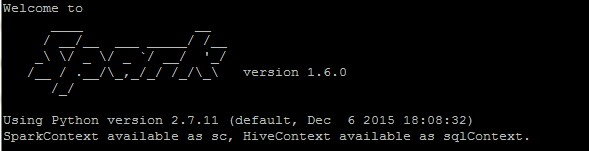

# Welcome to PySpark CLI Documentation

This documentation contains the step-by-step procedure to create a PySpark project using a CLI. Please visit PySparkCLI [here](https://github.com/qburst/PySparkCLI).

# What you should already know

Apache Spark is a fast and general-purpose cluster computing system. It provides high-level APIs in Java, Scala, Python and R, and an optimized engine that supports general execution graphs. It also supports a rich set of higher-level tools including Spark SQL for SQL and structured data processing, MLlib for machine learning, GraphX for graph processing, and Spark Streaming.

PySpark is the Python API for Spark.

# Apache Spark and PySpark
Apache Spark is an open-source distributed general-purpose cluster computing framework with (mostly) in-memory data processing engine that can do ETL, analytics, machine learning and graph processing on large volumes of data at rest (batch processing) or in motion (streaming processing) with rich concise high-level APIs for the programming languages: Scala, Python, Java, R, and SQL.

You could also describe Spark as a distributed, data processing engine for batch and streaming modes featuring SQL queries, graph processing, and machine learning. In contrast to Hadoop’s two-stage disk-based MapReduce computation engine, Spark’s multi-stage (mostly) in-memory computing engine allows for running most computations in memory, and hence most of the time provides better performance for certain applications, e.g. iterative algorithms or interactive data mining (read Spark officially sets a new record in large-scale sorting). Spark aims at speed, ease of use, extensibility and interactive analytics. Spark is often called cluster computing engine or simply execution engine. Spark is a distributed platform for executing complex multi-stage applications, like machine learning algorithms, and interactive ad hoc queries. Spark provides an efficient abstraction for in-memory cluster computing called Resilient Distributed Dataset. Using Spark Application Frameworks, Spark simplifies access to machine learning and predictive analytics at scale. Spark is mainly written in Scala, but provides developer API for languages like Java, Python, and R.

Why Spark?

* Easy to Get Started - Spark offers spark-shell that makes for a very easy head start to writing and running Spark applications on the command line on your laptop. You could then use Spark Standalone built-in cluster manager to deploy your Spark applications to a production-grade cluster to run on a full dataset.
* Unified Engine for Diverse Workloads - Spark combines batch, interactive, and streaming workloads under one rich concise API. Spark supports near real-time streaming workloads via Spark Streaming application framework. ETL workloads and Analytics workloads are different, however Spark attempts to offer a unified platform for a wide variety of workloads. Graph and Machine Learning algorithms are iterative by nature and less saves to disk or transfers over network means better performance. There is also support for interactive workloads using Spark shell.
* Leverages the Best in distributed batch data processing - When you think about distributed batch data processing, Hadoop naturally comes to mind as a viable solution. Spark draws many ideas out of Hadoop MapReduce. They work together well - Spark on YARN and HDFS - while improving on the performance and simplicity of the distributed computing engine. For many, Spark is Hadoop++, i.e. MapReduce done in a better way. And it should not come as a surprise, without Hadoop MapReduce (its advances and deficiencies), Spark would not have been born at all.
* Interactive Exploration / Exploratory Analytics - It is also called ad hoc queries. Using the Spark shell you can execute computations to process large amount of data (The Big Data). It’s all interactive and very useful to explore the data before final production release.
* RDD - Distributed Parallel Scala Collections As a Scala developer, you may find Spark’s RDD API very similar (if not identical) to Scala’s Collections API. It is also exposed in Java, Python and R (as well as SQL, i.e. SparkSQL, in a sense).
* Rich Standard Library - Not only can you use map and reduce (as in Hadoop MapReduce jobs) in Spark, but also a vast array of other higher-level operators to ease your Spark queries and application development. It expanded on the available computation styles beyond the only map-and-reduce available in Hadoop MapReduce.
* Unified development and deployment environment for all - Regardless of the Spark tools you use - the Spark API for the many programming languages supported - Scala, Java, Python, R, or the Spark shell, or the many Spark Application Frameworks leveraging the concept of RDD, i.e. Spark SQL, Spark Streaming, Spark MLlib and Spark GraphX, you still use the same development and deployment environment to for large data sets to yield a result, be it a prediction (Spark MLlib), a structured data queries (Spark SQL) or just a large distributed batch (Spark Core) or streaming (Spark Streaming) computation.
* Single Environment - Regardless of which programming language you are good at, be it Scala, Java, Python, R or SQL, you can use the same single clustered runtime environment for prototyping, ad hoc queries, and deploying your applications leveraging the many ingestion data points offered by the Spark platform.
* Data Integration Toolkit with Rich Set of Supported Data Sources - Spark can read from many types of data sources — relational, NoSQL, file systems, etc. — using many types of data formats - Parquet, Avro, CSV, JSON.
* Tools unavailable then, at your fingertips now - Spark embraces many concepts in a single unified development and runtime environment. Machine learning that is so tool- and feature-rich in Python, e.g. SciKit library, can now be used by Scala developers (as Pipeline API in Spark MLlib or calling pipe()). DataFrames from R are available in Scala, Java, Python, R APIs. Single node computations in machine learning algorithms are migrated to their distributed versions in Spark MLlib.
* Low-level Optimizations - Apache Spark uses a directed acyclic graph (DAG) of computation stages (aka execution DAG). It postpones any processing until really required for actions. Spark’s lazy evaluation gives plenty of opportunities to induce low-level optimizations (so users have to know less to do more).
* Excels at low-latency iterative workloads - Spark supports diverse workloads, but successfully targets low-latency iterative ones. They are often used in Machine Learning and graph algorithms.
* ETL done easier - Spark gives Extract, Transform and Load (ETL) a new look with the many programming languages supported - Scala, Java, Python (less likely R). You can use them all or pick the best for a problem. Scala in Spark, especially, makes for a much less boiler-plate code (comparing to other languages and approaches like MapReduce in Java).
* Unified Concise High-Level API - Spark offers a unified, concise, high-level APIs for batch analytics (RDD API), SQL queries (Dataset API), real-time analysis (DStream API), machine learning (ML Pipeline API) and graph processing (Graph API).
* Different kinds of data processing using unified API - Spark offers three kinds of data processing using batch, interactive, and stream processing with the unified API and data structures.
* Little to no disk use for better performance
* Fault Tolerance included
* Small Codebase Invites Contributors

# Writing your first PySpark App

Let’s learn by example. We’ll assume you have PySpark installed already. You can tell PySpark is installed and which version by running the following command in a shell prompt (indicated by the $ prefix):

`$pyspark`

If PySpark is installed, you should see the version of your installation. If it isn’t, you’ll get an error. This tutorial is written for Spark 2.4.4, which supports Python 2.7.15 and later.

# Prerequisites

Follow these steps to set-up the environment required for working with PySpark projects. For installation in Windows, follow the link How to Install Apache Spark on Windows. For installation on Ubuntu, follow these steps:

1. Download and Install JDK 8 or above. Before you can start with spark and hadoop, you need to make sure you have java 8 installed, or to install it.

You should check Java by running following command:

 `java -version`
                
Select the code in the pad and hit Ctrl+R to watch it unfold in your browser!
If JDK 8 is not installed you should follow the tutorial How to Install Oracle Java JDK 8 in Ubuntu 16.04?

2. Download and install Apache Spark Now the next step is to download latest distribution of Spark. Visit the website https://spark.apache.org/downloads.html and there you will find the latest distribution of Spark framework.

Create a directory spark with following command in your home.

`mkdir spark`

Move spark-2.4.4-bin-hadoop2.7.tgz in the spark directory:

```
mv ~/Downloads/spark-2.3.0-bin-hadoop2.7.tgz spark 
cd spark/ 
tar -xzvf 
spark-2.4.4-bin-hadoop2.7.tgz
```                    

After extracting the file go to bin directory of spark and run ./pyspark. It will open following pyspark shell:
pyspark_shell

3. Configure Apache Spark Now you should configure it in path so that it can be executed from anywhere.

Open bash_profile file:
 `vi ~/.bash_profile`
                
Add following entry:
```
export SPARK_HOME=~/spark/spark-2.4.4-bin-hadoop2.7/ 
export PATH="$SPARK_HOME/bin:$PATH"
```

Run the following command to update PATH variable in the current session:
`source ~/.bash_profile`
                
After next login you should be able to find pyspark command in path and it can be accessed from any directory.
4. Check PySpark installation

In your anaconda prompt,or any python supporting cmd, type pyspark, to enter pyspark shell. To be prepared, best to check it in the python environment from which you run jupyter notebook. You are supposed to see the following:



pyspark_shell
Run the following commands, the output should be [1,4,9,16].
```
$ pyspark 
>>> nums = sc.parallelize([1,2,3,4]) 
>>> nums.map(lambda x: x*x).collect()
```

To exit pyspark shell, type Ctrl-z and enter. Or the python command exit()
5. Install PySpark using pip

In your anaconda prompt,or any python supporting cmd, run the following command:
pip install pyspark
Run the following commands, this should open up teh pyspark shell.
`pyspark`
                    
To exit pyspark shell, type Ctrl-z and enter. Or the python command exit()

## Installation Steps
    
    git clone https://github.com/qburst/PySparkCLI.git

    cd PySparkCLI

    pip3 install -e . --user

## Commands

* `pysparkcli create [project-name]` - Create a new project.
    - Run the following code to create your project `sample`:
        
        `pysparkcli create sample -m local[*] -c 2 -t default`

        * master: master is the URL of the cluster it connects to. You can also use -m instead of --master.
        * project_type: project_type is the type of the project you want to create like default, streaming etc. You can also use -t instead of --project_type.
        * cores : This controls the number of parallel tasks an executor can run. You can also use -c instead of --cores.

    - You'll see the following in your command line:

        ```
        Completed building project: sample
        ```

* `pysparkcli run [project-path]` - Run the project by path.
    - Run the following code to run your project `sample`:
    
        ```
        virtualenv --python=/usr/bin/python3.7 sample.env
        source sample.env/bin/activate
        pysparkcli run sample
        ```

    - You'll see the following in your command line:

        ```
        Started running project: sample/
        19/11/25 10:37:07 WARN NativeCodeLoader: Unable to load native-hadoop library for your platform... using
        builtin-java classes where applicable
        Hello World!.
        ```
        
* `pysparkcli stream [project-path] [stream-file-path]` - Initiate the stream.
    - Run the following code to  stream data for project `sample` using `twitter_stream` file:
    
        `pysparkcli stream sample twitter_stream`

    - You'll see the following in your command line:

        ```
        (streaming_project_env) ➜  checking git:(docs_develop) ✗ pysparkcli stream test twitter_stream
        Started streaming of project: test
        Requirement already satisfied: certifi==2019.11.28 in ./streaming_project_env/lib/python3.6/site-packages (from -r test/requirements.txt (line 1))
        Requirement already satisfied: chardet==3.0.4 in ./streaming_project_env/lib/python3.6/site-packages (from -r test/requirements.txt (line 2))
        Requirement already satisfied: idna==2.8 in ./streaming_project_env/lib/python3.6/site-packages (from -r test/requirements.txt (line 3))
        Requirement already satisfied: oauthlib==3.1.0 in ./streaming_project_env/lib/python3.6/site-packages (from -r test/requirements.txt (line 4))
        Requirement already satisfied: py4j==0.10.7 in ./streaming_project_env/lib/python3.6/site-packages (from -r test/requirements.txt (line 5))
        Requirement already satisfied: PySocks==1.7.1 in ./streaming_project_env/lib/python3.6/site-packages (from -r test/requirements.txt (line 6))
        Requirement already satisfied: pyspark==2.4.4 in ./streaming_project_env/lib/python3.6/site-packages (from -r test/requirements.txt (line 7))
        Requirement already satisfied: requests==2.22.0 in ./streaming_project_env/lib/python3.6/site-packages (from -r test/requirements.txt (line 8))
        Requirement already satisfied: requests-oauthlib==1.3.0 in ./streaming_project_env/lib/python3.6/site-packages (from -r test/requirements.txt (line 9))
        Requirement already satisfied: six==1.13.0 in ./streaming_project_env/lib/python3.6/site-packages (from -r test/requirements.txt (line 10))
        Requirement already satisfied: tweepy==3.8.0 in ./streaming_project_env/lib/python3.6/site-packages (from -r test/requirements.txt (line 11))
        Requirement already satisfied: urllib3==1.25.7 in ./streaming_project_env/lib/python3.6/site-packages (from -r test/requirements.txt (line 12))
        Listening on port: 5555
        ```

* `pysparkcli test [project-path]` - Run the project by path.
    - Run the following code to run all tests for your project `sample`:
    
        `pysparkcli test sample`
        
    - You'll see the following in your command line:

        ```
        Started running test cases for project: sample
        19/12/09 14:02:13 WARN NativeCodeLoader: Unable to load native-hadoop library for your platform... using builtin-java classes where applicable
        /usr/lib/python3.7/socket.py:660: ResourceWarning: unclosed <socket.socket fd=5, family=AddressFamily.AF_INET, type=SocketKind.SOCK_STREAM, proto=6, laddr=('127.0.0.1', 48848), raddr=('127.0.0.1', 32857)>
            self._sock = None
        ResourceWarning: Enable tracemalloc to get the object allocation traceback
        /usr/lib/python3.7/socket.py:660: ResourceWarning: unclosed <socket.socket fd=5, family=AddressFamily.AF_INET, type=SocketKind.SOCK_STREAM, proto=6, laddr=('127.0.0.1', 58534), raddr=('127.0.0.1', 42687)>
            self._sock = None
        ResourceWarning: Enable tracemalloc to get the object allocation traceback
        .
        ----------------------------------------------------------------------
        Ran 1 test in 6.041s

        OK
        ```

## FAQ

Common issues while installing pysparkcli:

    * pysparkcli: command not found
        Make sure you add user’s local bin to PATH variable.
        Add the following code in .bashrc file

        # set PATH so it includes user's private bin if it exists
        if [ -d "$HOME/.local/bin" ] ; then
            PATH="$HOME/.local/bin:$PATH"
        fi


    * JAVA_HOME is not set
        Make sure JAVA_HOME is pointing to your JDK and PYSPARK_PYTHON variable is created.
        You can add them manually by in .bashrc file:
        
        Example:

            export PYSPARK_PYTHON=python3
            export JAVA_HOME=/usr/lib/jvm/java-8-openjdk-amd64

        Save the file and run the following to update environment.

            source ~/.bashrc


## Project layout

    hello-world/
    ├── __init__.py
    ├── src
    │   ├── app.py
    │   ├── configs
    │   │   ├── etl_config.py
    │   │   └── __init__.py
    │   ├── __init__.py
    │   ├── jobs
    │   │   ├── etl_job.py
    │   │   └── __init__.py
    │   └── settings
    │       ├── default.py
    │       ├── __init__.py
    │       ├── local.py
    │       └── production.py
    └── tests
        ├── __init__.py
        ├── test_data
        │   ├── employees
        │   │   └── part-00000-9abf32a3-db43-42e1-9639-363ef11c0d1c-c000.snappy.parquet
        │   └── employees_report
        │       └── part-00000-4a609ba3-0404-48bb-bb22-2fec3e2f1e68-c000.snappy.parquet
        └── test_etl_job.py

    8 directories, 15 files

# References
All the documentation in this page is taken from:

* [Apache Spark](https://spark.apache.org/docs/latest/)
* [PySpark](https://spark.apache.org/docs/latest/api/python/pyspark.html)
* [Download Apache Spark](https://spark.apache.org/downloads.html)

# Credits

We formulated the basic structure for this PySpark project from inputs from the following repositories:

* [pyspark-example-project](https://github.com/AlexIoannides/pyspark-example-project)
* [PySpark-Boilerplate](https://github.com/ekampf/PySpark-Boilerplate)